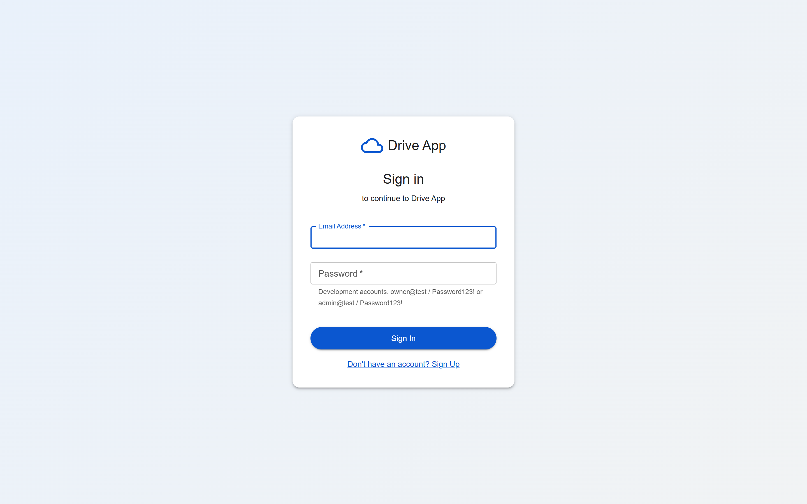
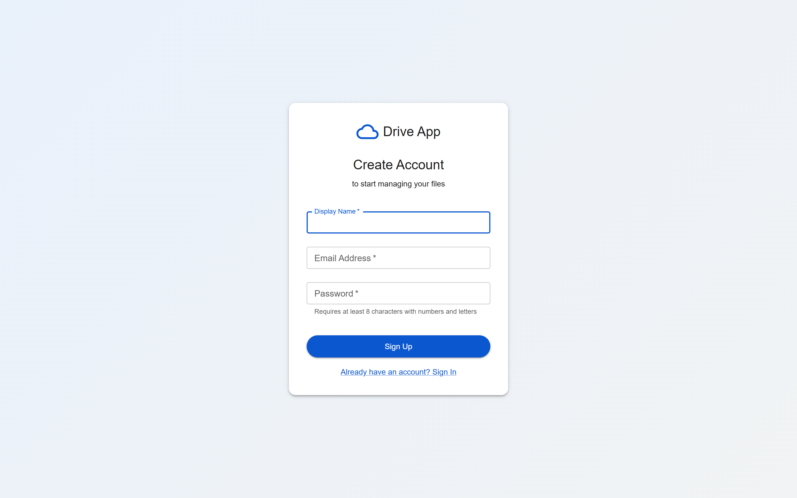
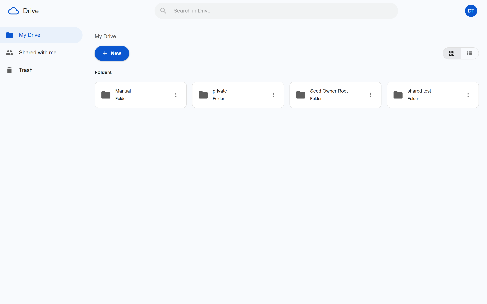
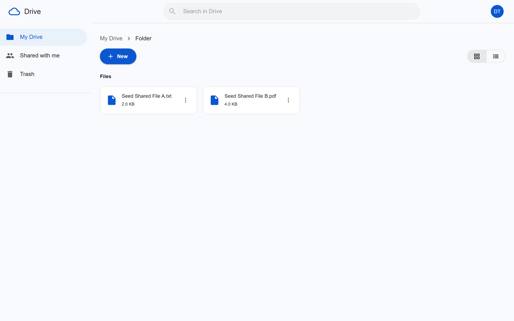
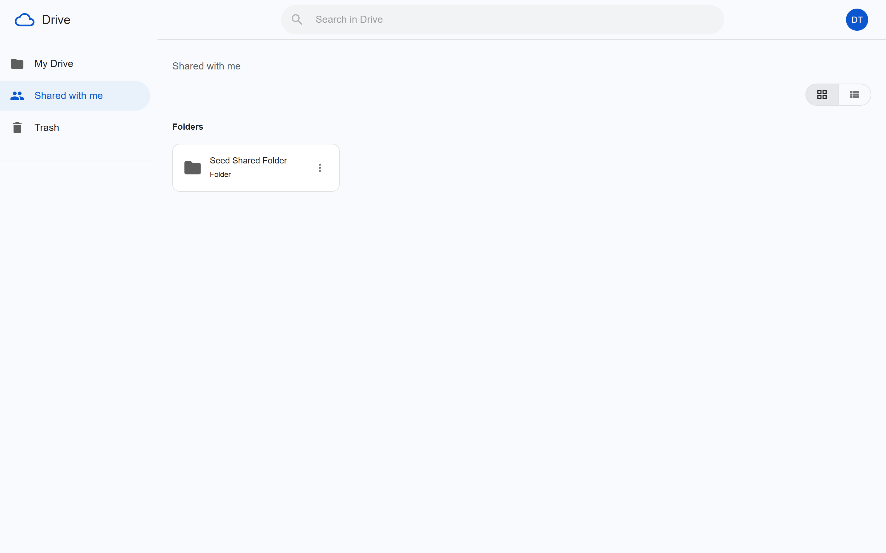
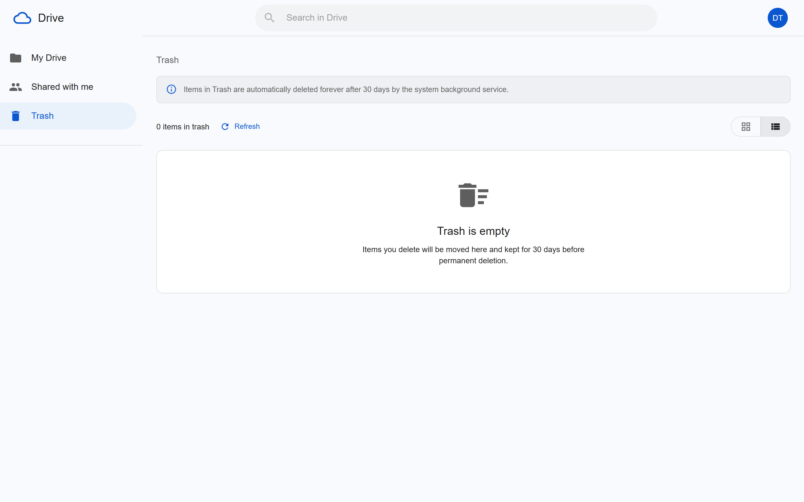
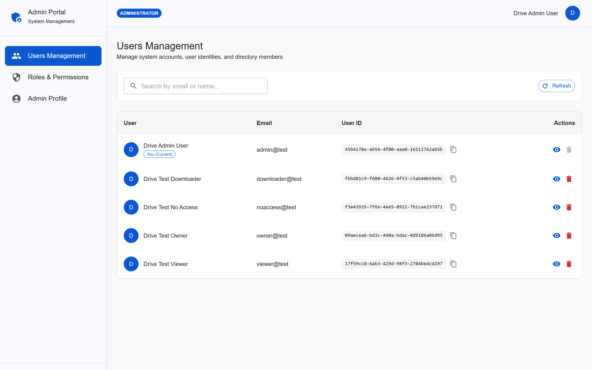
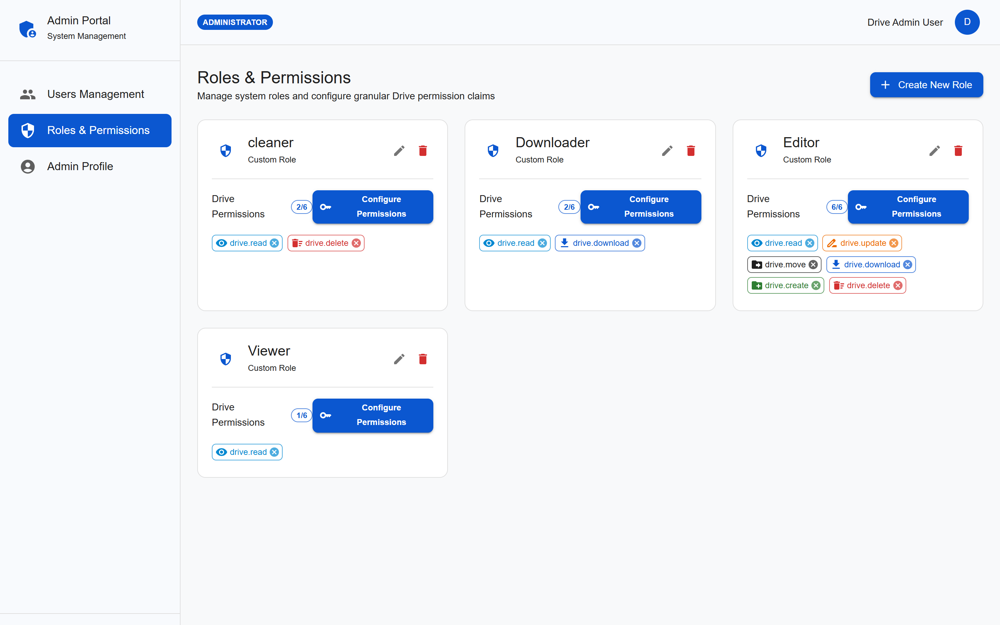
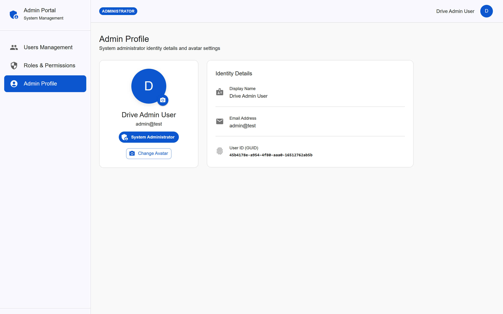

# Drive App (Frontend)

Web application for Drive file storage, role-based sharing, and user administration**.

---

## Demo & Screenshots

### 1. Authentication & Onboarding
| Sign In | Sign Up |
| :---: | :---: |
|  |  |

---

### 2. Drive & File Management
#### My Drive (Root & Folders)
Intuitive file explorer supporting grid/list layouts, folder creation, file uploads, search, and context actions.


#### Folder Navigation & File Items
Granular inspection of nested folders and file metadata (size, mime type, actions).


#### Shared With Me
Access items and folders shared by other users according to assigned permissions (Viewer, Downloader, Editor).


#### Trash & Recovery
Soft-delete protection with item restore and permanent purge capabilities.


---

### 3. Administrator Portal
#### User Management
Manage directory members, view system IDs, search accounts, and handle role assignments.


#### Roles & Permissions Matrix
Configure granular permission claims (`drive.read`, `drive.download`, `drive.create`, `drive.update`, `drive.move`, `drive.delete`) across custom and built-in roles.


#### Administrator Profile
View identity attributes, account roles, and manage profile avatar settings.


---

## Tech Stack

- **Framework:** [React 19](https://react.dev/)
- **Build Tool:** [Vite 8](https://vite.dev/)
- **UI & Component Library:** [Material UI (MUI v9)](https://mui.com/) & Emotion
- **Routing & Guards:** [React Router v7](https://reactrouter.com/)
- **State Management:** React Context API (`AuthContext`, custom hooks)
- **Linter & Code Quality:** [Oxlint](https://oxc.rs/)

---

## Getting Started

### 1. Prerequisites
- **Node.js** >= 18.x (Recommended: v20+)
- **npm** or **yarn** / **pnpm**
- Running **Drive API Backend** (default: `http://localhost:5213` or `https://localhost:7157`)

### 2. Installation
```bash
# Navigate to the frontend directory
cd drive-app

# Install dependencies
npm install
```

### 3. Environment Configuration
Create a `.env` file in the `drive-app` root if you need custom API URLs:
```env
VITE_API_URL=/api
```
*(Development server proxies `/api` requests to `http://localhost:5213`)*

### 4. Run Development Server
```bash
cd drive-app
npm run dev
```
Open [http://localhost:5173](http://localhost:5173) in your browser.

---

## Test Accounts

The backend seed provides ready-to-use testing accounts:

| Role | Email | Password | Access Scope |
| :--- | :--- | :--- | :--- |
| **Administrator** | `admin@test` | `Password123!` | Admin Portal (`/admin/*`) |
| **Owner / User** | `owner@test` | `Password123!` | My Drive, File Uploads, Sharing |
| **Downloader** | `downloader@test` | `Password123!` | Shared Items (Read + Download) |
| **Viewer** | `viewer@test` | `Password123!` | Shared Items (Read-only) |

---

## 📜 Available Scripts

- `npm run dev`: Starts the local development server with HMR.
- `npm run build`: Compiles and bundles production-ready assets into `dist/`.
- `npm run preview`: Locally previews the production build.
- `npm run lint`: Runs fast code linting via Oxlint.
